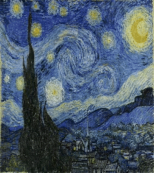
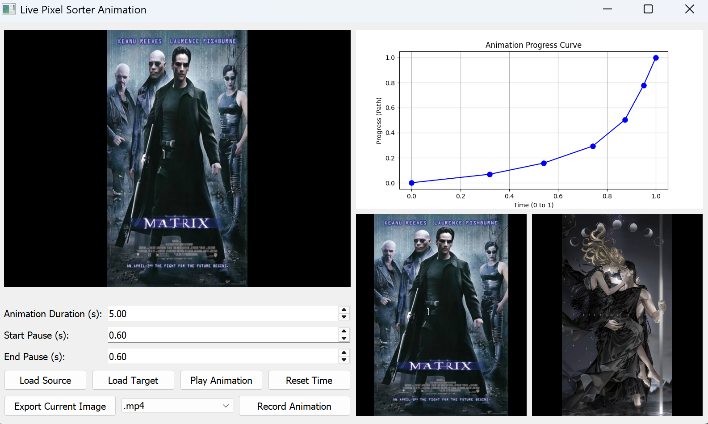

# Image Morphing Animation

A geometric image morphing tool that takes ANY two images (an arbitrarily chosen **Source Image** and a **Target Image**), and morphs the pixels from the source into the shape of the target using 1D visual luminance sorting! This project features a live, interactive UI that allows you to control the exact speed and easing curve of the animation to visualize complex transformations smoothly!

## Example Morphing Results

<table>
  <tr>
    <td align="center"></td>
    <td align="center"></td>
    <td align="center"></td>
  </tr>
  <tr>
    <td align="center"><b>Image A ➜ Image B (Morph)</b></td>
    <td align="center"><b>Image B ➜ Image A (Reverse)</b></td>
    <td align="center"><b>Matrix ➜ ORV (Animation)</b></td>
  </tr>
</table>

---

## 💻 Interactive UI Workspace

|  |
|:----------------------------------------:|
|           **Full Application View**      |

---

## 📋 Table of Contents

- [Overview](#overview)
- [Requirements](#requirements)
- [Usage & Instructions](#usage)
- [Exporting Results](#exporting-results)

---

## 🎯 Overview

This application acts as a sandbox for pixel geometry morphing. By evaluating the relative luminance and brightness index of every specific pixel, the `N` pixels from an image source mathematically map their coordinates perfectly into an image target without creating duplicate pixels. 

---

## 📦 Requirements
Ensure you have Python 3.7+ installed.

1. Navigate to this directory in your terminal.
2. Install the required dependencies:
   ```bash
   pip install -r requirements.txt
   ```

---

## 🚀 Usage
Run the application using:
```bash
python main.py
```

### INSTRUCTIONS:
1. Click **Load Source Image** and select any image (larger images will be automatically downscaled slightly to maintain a smooth 60 FPS animation).
2. Click **Load Target Image** and select another completely different image.
3. You can customize the **Animation Duration** and the **Start and End Pauses** directly below the images. By default, it runs for 3.0 seconds and pauses for 0.2 seconds at the start and end of the animation!
4. Wait a moment for it to process the geometry mapping.
4. Look at the right panel: The **Animation Progress Curve** controls the speed and direction of the pixel animation. 
   - **X-axis** is the time of the animation (Starts at 0, ends at 1).
   - **Y-axis** is the progress of the pixels along their path (0 is their original position, 1 is their final morphed position).
5. **Interact with the Graph**: 
   - **Play around intuitively**: Click anywhere on the line to immediately create a new control point at your mouse and start dragging it!
   - **Drag** any blue control points to change the curve. 
   - Example: Try dragging a point downwards to make the pixels go backwards!
6. Click **Play Animation** to watch the pixels sort themselves based on your custom easing curve!
7. Click **Reset Time** at any point to snap the animation back to the beginning.

## Exporting Results
- Want to save your creation? You can click **Export Current Image** to save the exact frame you are looking at to the `results/` folder!
- You can also record the entire timeline animation directly! Simply choose **.mp4**, then click **Record Animation**. The application will silently render all 30FPS frames and output a perfectly smooth video file into the `results/` folder for you to share!
